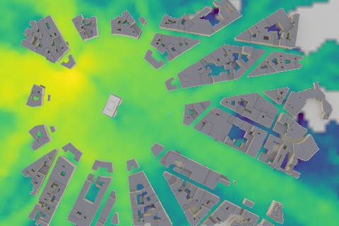
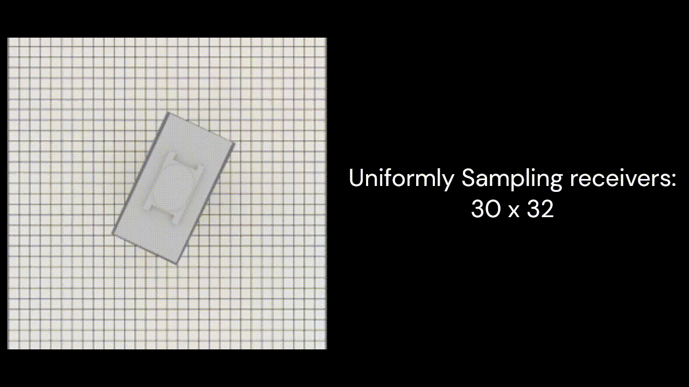

## RayProNet: A Neural Point Field Framework for Radio Propagation Modeling in 3D Environments



### [Project Page](git@github.com:GeCao/neural-point-EM-field.git) 
#### Ge Cao, Zhen Peng


The radio wave propagation channel is central to the performance of wireless communication systems. 
In this paper, we introduce a novel machine learning-empowered methodology for wireless channel modeling.
The key ingredients include a point-cloud-based neural network and a spherical Harmonics encoder with light probes. 
Our approach offers several significant advantages, including the flexibility to adjust antenna radiation patterns and transmitter/receiver locations, the capability to predict radio power maps, and the scalability of large-scale wireless scenes. As a result, it lays the groundwork for an end-to-end pipeline for network planning and deployment optimization. The proposed work is validated in various outdoor and indoor radio environments.

---


---

### Data Preparation
#### 
- We store our dataset under the directory: `data/{dataset_name}/{train.h5, validation.h5, obj/{*.obj, *.ply, *.json, etc.}}`
- The training dataset and validation dataset of the paper can be found by: [dataset.zip](https://drive.google.com/file/d/1jm9j1hcFt4OAUoNVnro1qrctXwkxB6cP/view?usp=sharing)
- We also provide a trained model: [trained_model.pt](https://drive.google.com/file/d/12ugcAMWa1I_k2xRSdFHiINEJqJf49JhS/view?usp=sharing), which should be placed into the directory: `save/{dataset_name}/model_{dataset_name}.pt`. After validation, you can collect your result at `save/{dataset_name}/imgs/pred_and_gt.h5`

---

### Requirements

Environment setup
```
conda create -n NeuralPointLF python=3.7
conda activate NeuralPointLF
```
Install required packages
```
conda install -c pytorch -c conda-forge pytorch=1.7.1 torchvision=0.8.2 cudatoolkit=11.0
conda install -c fvcore -c iopath -c conda-forge fvcore iopath
conda install -c bottler nvidiacub
conda install jupyterlab
pip install scikit-image matplotlib imageio plotly opencv-python
conda install pytorch3d -c pytorch3d
conda install -c open3d-admin -c conda-forge open3d
```

---
### Training and Validation (Both in one file)
```
cd demo
python demo_EM.py
```

---
#### Citation
```
TODO:
```


